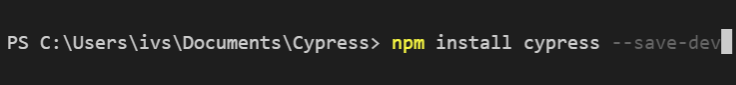

# CYPRESS
# install_project
*  Bước 1:Kiểm tra xem đã có node js và npm chưa 
 
* Bước 2: Tạo một thư mục 
 
* Bước 3:Chạy lệnh npm init: 
 
* Bước 4: Bước 4:Cài đặt cypress: 
 
* Bước 5: Vào file package.json: 
 
Thêm vào script:  
+   "cy:open":"cypress open": để mở cypress lên 
+   "cy:run":"cypress run": để chạy cypress  
* Bước 6: Mở cypress lên dùng lệnh: 
+   cypress open or ./node_modules/.bin/cypress open 
 
* Bước 7: Chạy cypress lên dùng lệnh:
+    cypress run or ./node_modules/.bin/cypress run 
 
# Các cách run  
* Chạy bằng lệnh ./node_modules/.bin/cypress run 
 
 
Kết quả trả về : Xuất hiện các thông số như hình phía trên 
* Chạy debug  

* Run bằng lệnh ./node_modules/.bin/cypress run --headed 
 
Kết quả: Hiển thị trình duyệt của từng trang lên 
* Run bằng lệnh ./node_modules/.bin/cypress run --headless 
 
 
Kết quả: Chạy liên tục ẩn trình duyệt của trang 
* Run bằng lệnh: ./node_modules/.bin/cypress run --browser chrome
 
Kết quả: Chạy bằng trình duyệt chrome, chạy liên tục không mở trình duyệt (dạng headless phía trên) 
* Run bằng lệnh:./node_modules/.bin/cypress run --spec "cypress/integration/examples/actions.spec.js": để chạy trong một thư mục chỉ định thay vì chạy tất cả các thư mục 

